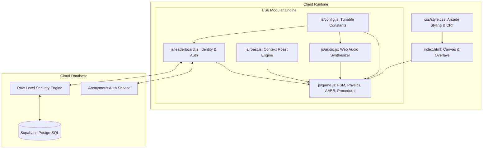
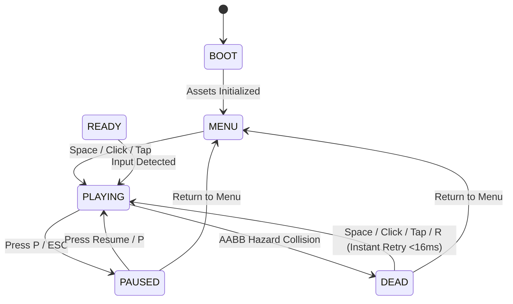

# BLOCK DASH — System Architecture & Technical Specifications

> **System Overview**: High-Performance, Zero-Dependency HTML5 Canvas Arcade Engine with Delta-Time Physics, Procedural Generation, Context-Aware Failure Analytics, and Supabase RLS Backend.

---

## 1. System Component Diagram



---

## 2. Finite State Machine (FSM) Lifecycle



---

## 3. Data Flow & Update Pipeline

```
[ Display V-Sync Refresh ]
          │
          ▼
[ requestAnimationFrame(currentTime) ]
          │
          ▼
[ Calculate Clamped Delta-Time dt = min((now - last)/1000, 0.1) ]
          │
          ▼
[ FSM State Check ]
          │
          ├── If PLAYING:
          │     ├── Accelerate Speed: v(score) = v_base + (v_max - v_base)*(1 - exp(-s/3200))
          │     ├── Update Player: vy += g*dt, y += vy*dt, rotation += rotSpeed*dt
          │     ├── Resolve Ground Plane: if (y >= groundY) snap to ground, vy = 0
          │     ├── Procedural Spawning: check nextSpawnX < rightBoundary + 300
          │     ├── Scroll Obstacles: x -= currentSpeed * dt
          │     ├── Execute AABB Collision Detection with 4px Coyote Padding
          │     └── Update Particle Lifecycles & Screen Shake Decay
          │
          ▼
[ Canvas 2D Batch Render Pipeline ]
          │
          ├── Clear Screen (charcoal #0b0c10)
          ├── Render Parallax Stars (multi-layer alpha)
          ├── Render Ground Grid with scrolling offset
          ├── Render Procedural Hazards (spikes, blocks, barriers)
          ├── Render Dust & Shatter Particles
          └── Render Player with Neon Fading Motion Trail
```

---

## 4. Entity Architecture & Bounding Geometry

| Entity | Dimensions ($w \times h$) | Hitbox Padding | Visual Characteristics |
| :--- | :--- | :--- | :--- |
| **Player Cube** | $40\text{px} \times 40\text{px}$ | $4\text{px}$ inset | Neon amber `#ff9f1c`, crisp white border, arcade visor, motion blur trail. |
| **Single Spike** | $36\text{px} \times 36\text{px}$ | $6\text{px}$ inset | Crimson hazard `#ff2a55`, glowing top crest, triangular AABB envelope. |
| **Double Spike** | $72\text{px} \times 36\text{px}$ | $6\text{px}$ inset | Two adjacent spikes requiring precise jump peak timing. |
| **Triple Spike** | $108\text{px} \times 36\text{px}$ | $6\text{px}$ inset | Late-game hazard requiring high velocity and exact entry jump. |
| **Block Hazard** | $40\text{px} \times 42\text{px}$ | $2\text{px}$ inset | Solid barrier `#e63946` with internal warning icon. |
| **High Barrier** | $44\text{px} \times 180\text{px}$ | $2\text{px}$ inset | Suspended ceiling hazard forcing low timing or no-jump recovery. |

---

## 5. Security & Threat Model

| Potential Attack / Threat | Mitigation Strategy | Implemented In |
| :--- | :--- | :--- |
| **Client-Side DevTools Score Manipulation** | Telemetry rate-limit check: `score <= survivalTime * 120 + 200`. Corrupt/unrealistic scores rejected before submission. | [`js/leaderboard.js`](file:///Users/rajkiranmishra/Block-Dash/js/leaderboard.js) |
| **Database Injection & Score Overwrites** | PostgreSQL Row Level Security (RLS) ensures players can only write to their own authenticated UUID. | [`supabase_schema.sql`](file:///Users/rajkiranmishra/Block-Dash/supabase_schema.sql) |
| **Malicious Display Name / XSS Injection** | Regex sanitization strips non-alphanumeric characters; HTML entities escaped in rendering. | [`js/leaderboard.js`](file:///Users/rajkiranmishra/Block-Dash/js/leaderboard.js) |
| **Secret Key Exposure** | Only public `anon-key` is used in client scripts. `service-role` key is strictly prohibited in frontend code. | [`js/config.js`](file:///Users/rajkiranmishra/Block-Dash/js/config.js) |
| **Offline / Network Drops** | Transparent fallback to browser `localStorage` stores personal bests with zero runtime crashes. | [`js/leaderboard.js`](file:///Users/rajkiranmishra/Block-Dash/js/leaderboard.js) |
