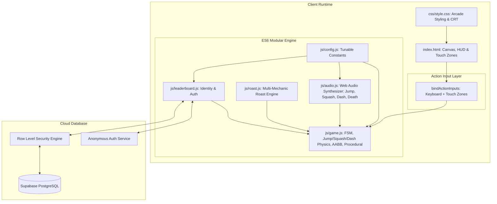
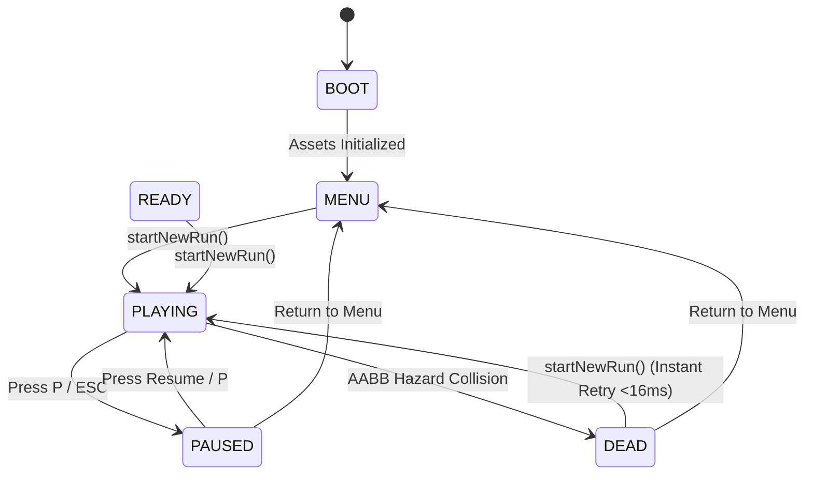

# BLOCK DASH — System Architecture & Technical Specifications

> **System Overview**: High-Performance, Zero-Dependency HTML5 Canvas Arcade Engine with Delta-Time Physics, Squash & Dash Mechanics, Mid-Air Hazards, Procedural Generation, Context-Aware Failure Analytics, and Supabase RLS Backend.

---

## 1. System Component Diagram

---

## 2. Finite State Machine (FSM) Lifecycle

---

## 3. Entity & Hazard Architecture

| Entity | Dimensions ($w \times h$) | Hitbox Padding | Required Mechanic | Visual Characteristics |
| :--- | :--- | :--- | :--- | :--- |
| **Player Cube** | $40\text{px} \times 40\text{px}$ (Normal) $50\text{px} \times 20\text{px}$ (Squashed) | $4\text{px}$ inset | Movement Base | Neon amber `#ff9f1c`, visor eye, cyan dash trail. |
| **Single Spike** | $36\text{px} \times 36\text{px}$ | $6\text{px}$ inset | **JUMP** | Crimson hazard `#ff2a55`, glowing top crest. |
| **Double Spike** | $72\text{px} \times 36\text{px}$ | $6\text{px}$ inset | **JUMP** | Two adjacent spikes requiring precise peak jump. |
| **Floating Laser Bar** | $90\text{px} \times 22\text{px}$ ($y=400$) | $3\text{px}$ inset | **SQUASH** | Neon pink/cyan overhead laser requiring slide. |
| **Floating Crosses** | $26\text{px} \times 26\text{px}$ ($y=395$) | $4\text{px}$ inset | **SQUASH / PRECISION** | Dual mid-air spinning hazard crosses. |
| **Energy Gate** | $32\text{px} \times 60\text{px}$ | $3\text{px}$ inset | **DASH / TIMING** | Tall vertical energy barrier requiring burst dash. |
| **Block Hazard** | $40\text{px} \times 42\text{px}$ | $2\text{px}$ inset | **JUMP** | Solid barrier `#e63946` with warning icon. |
