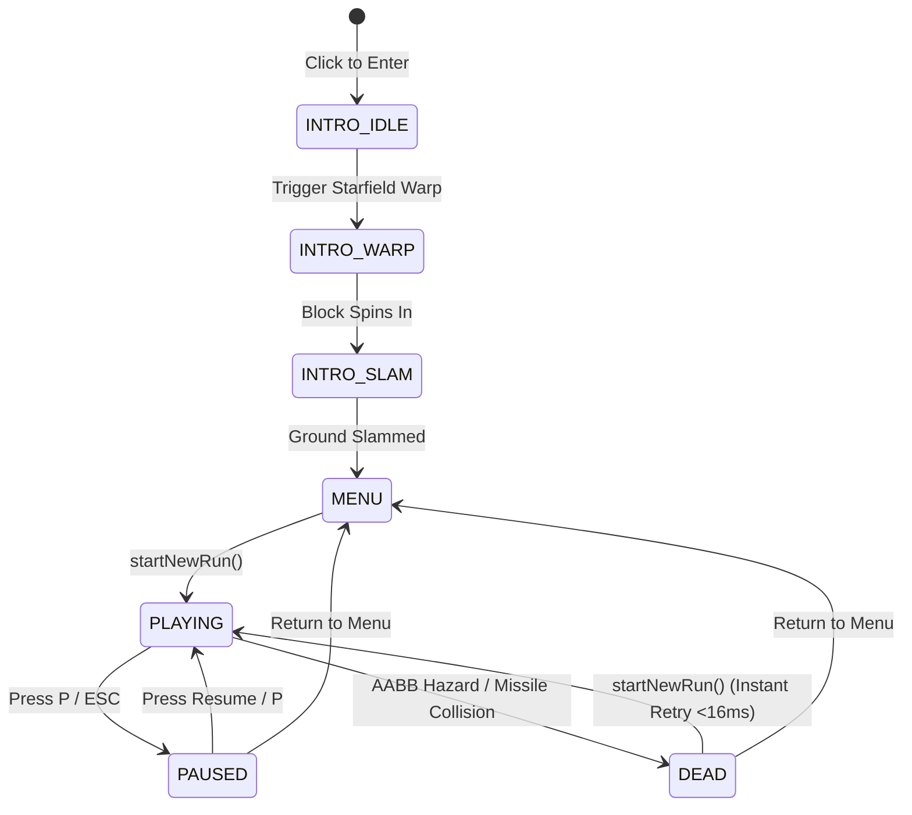
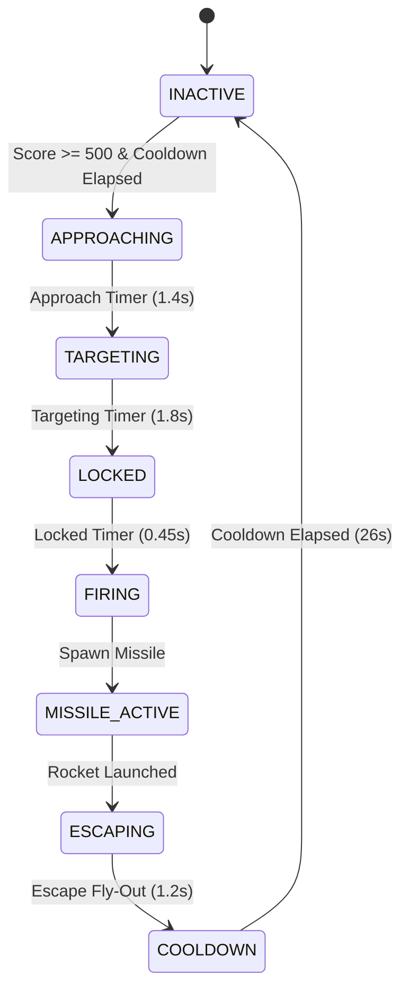

# BLOCK DASH — System Architecture & Technical Specifications

> **System Overview**: High-Performance, Zero-Dependency HTML5 Canvas Arcade Engine with Delta-Time Physics, Squash & Dash Mechanics, Mid-Air Hazards, Space Interceptor Encounter Director, Predictive Targeting, Context-Aware Failure Analytics, and Supabase RLS Backend.

---

## 1. System Component Diagram

```mermaid
graph TD
    subgraph Browser Client [Client Runtime]
        HTML[index.html: Canvas, HUD & Touch Zones]
        CSS[css/style.css: Arcade Styling & CRT]
        
        subgraph Input Layer [Action Input Layer]
            INP[bindActionInputs: Keyboard + Touch Zones]
        end

        subgraph Engine Modules [ES6 Modular Engine]
            CFG[js/config.js: Tunable Constants]
            AUD[js/audio.js: Web Audio Synth: Jump, Dash, Beeps, Missiles]
            ROAST[js/roast.js: Multi-Mechanic Roast Engine]
            LDR[js/leaderboard.js: Identity & Auth]
            
            subgraph Game Engine [js/game.js Core]
                DIR[Event Director: Pacing & Safety]
                FSM[Game FSM: Intro, Menu, Play, Dead]
                PHYS[Delta-Time Euler Physics & Jump/Squash/Dash]
                INT[Space Interceptor FSM & Predictive Targeting]
                PROC[Procedural Generator & Rejection Sampling]
                COLL[AABB Collision & Environmental Demolition]
            end
        end
    end

    subgraph Backend Infrastructure [Cloud Database]
        SB[(Supabase PostgreSQL)]
        RLS[Row Level Security Engine]
        AUTH[Anonymous Auth Service]
    end

    HTML --> INP
    INP --> FSM
    CSS --> HTML
    CFG --> Game Engine
    CFG --> LDR
    CFG --> AUD
    AUD --> Game Engine
    ROAST --> Game Engine
    LDR --> Game Engine
    LDR <--> AUTH
    LDR <--> RLS
    RLS <--> SB
```

---

## 2. Finite State Machines (FSM)

### A. Game Level FSM


### B. Space Interceptor Sub-FSM


---

## 3. Entity & Hazard Architecture

| Entity | Dimensions ($w \times h$) | Hitbox Padding | Required Mechanic | Visual Characteristics |
| :--- | :--- | :--- | :--- | :--- |
| **Player Cube** | $40\text{px} \times 40\text{px}$ (Normal)<br>$50\text{px} \times 20\text{px}$ (Squashed) | $4\text{px}$ inset | Movement Base | Neon amber `#ff9f1c`, visor eye, cyan dash trail. |
| **Space Interceptor** | $64\text{px} \times 32\text{px}$ | N/A (Sky-Bound) | **DODGE / BAIT** | Dark stealth hull `#1c2030`, cyan plasma engines, crimson laser emitter. |
| **Ground Missile** | $32\text{px} \times 14\text{px}$ ($y \approx 425$) | $3\text{px}$ inset | **JUMP** | Low-skimming kinetic rocket with particle exhaust. |
| **High Missile** | $32\text{px} \times 14\text{px}$ ($y \approx 390$) | $3\text{px}$ inset | **SQUASH / SLIDE** | Head-height guided missile requiring ducking slide. |
| **Tracking Missile**| $32\text{px} \times 14\text{px}$ | $3\text{px}$ inset | **DASH / TIMING** | Semi-guided seeker that locks trajectory after $0.35\text{s}$. |
| **Single Spike** | $36\text{px} \times 36\text{px}$ | $6\text{px}$ inset | **JUMP** | Crimson hazard `#ff2a55`, glowing top crest. |
| **Double Spike** | $72\text{px} \times 36\text{px}$ | $6\text{px}$ inset | **JUMP** | Two adjacent spikes requiring precise peak jump. |
| **Floating Laser Bar** | $90\text{px} \times 22\text{px}$ ($y=400$) | $3\text{px}$ inset | **SQUASH** | Neon pink/cyan overhead laser requiring slide. |
| **Floating Crosses** | $26\text{px} \times 26\text{px}$ ($y=395$) | $4\text{px}$ inset | **SQUASH / PRECISION** | Dual mid-air spinning hazard crosses. |
| **Energy Gate** | $32\text{px} \times 60\text{px}$ | $3\text{px}$ inset | **DASH / TIMING** | Tall vertical energy barrier requiring burst dash. |
| **Block Hazard** | $40\text{px} \times 42\text{px}$ | $2\text{px}$ inset | **JUMP** | Solid barrier `#e63946` with warning icon. |
