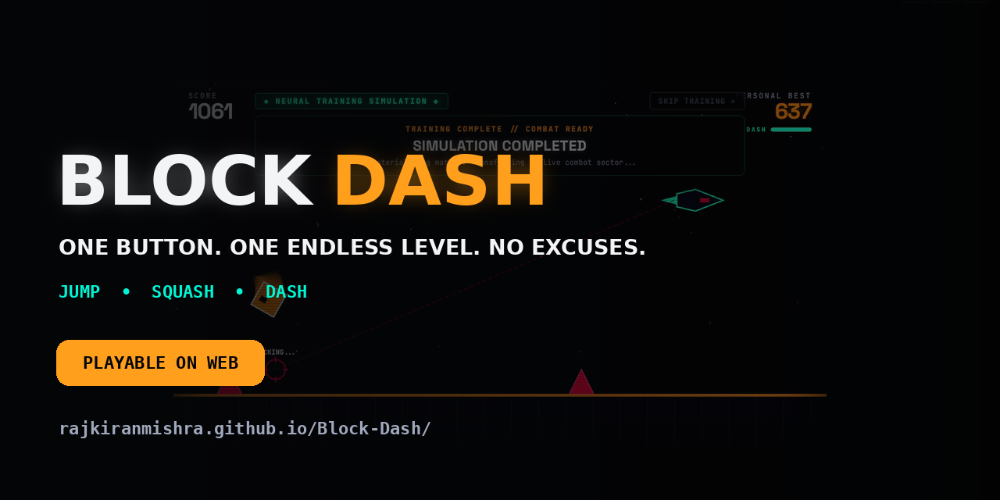
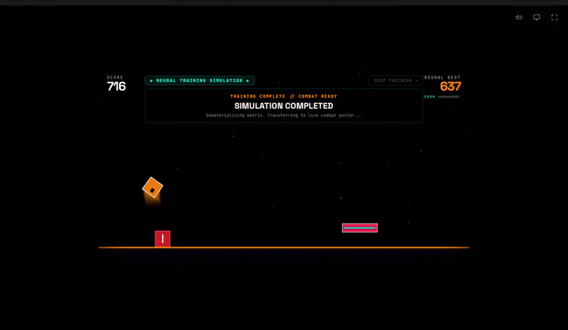
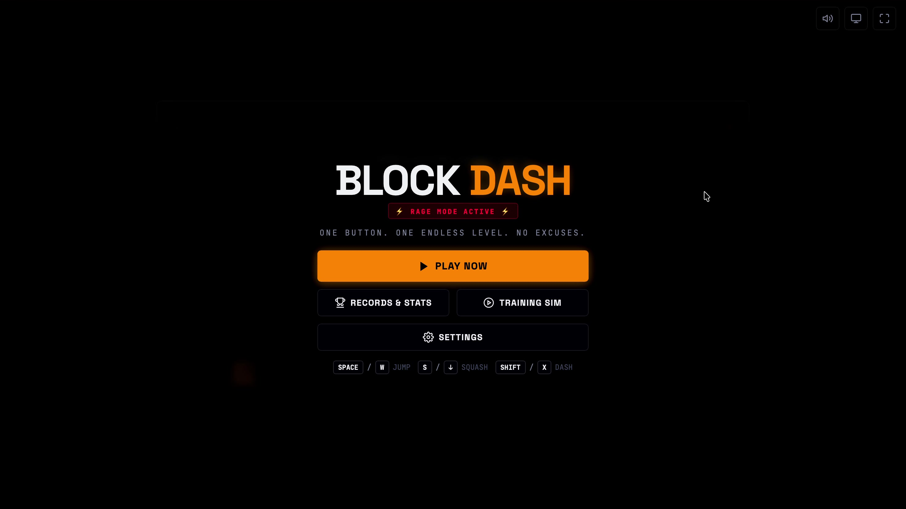
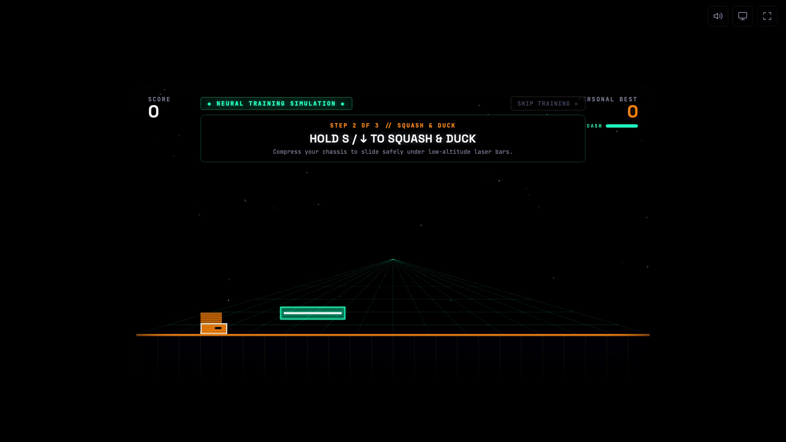
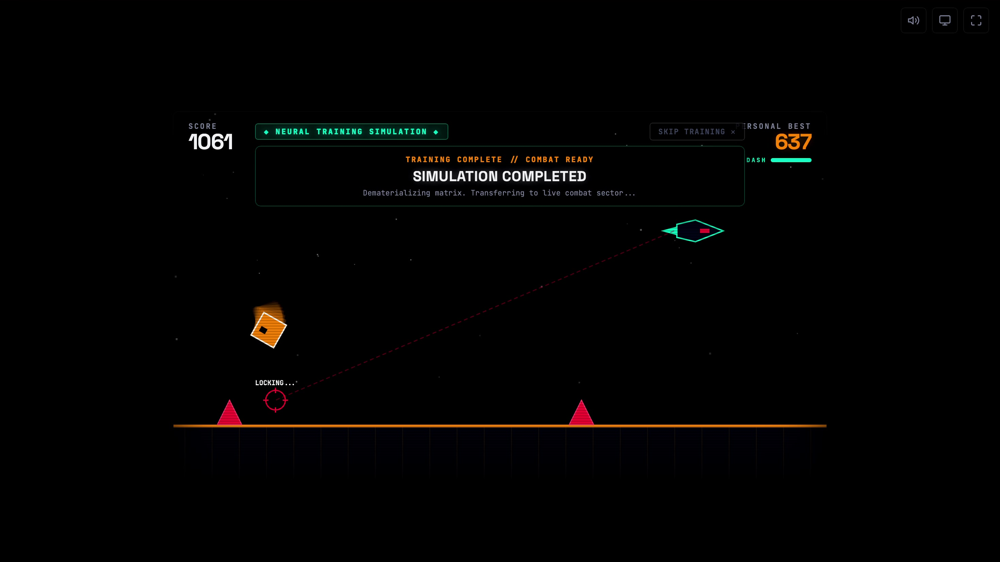

# BLOCK DASH

<p align="center">
  
</p>

<p align="center">
  <a href="https://rajkiranmishra.github.io/Block-Dash/"><strong>🎮 PLAY BLOCK DASH</strong></a>
  &nbsp;•&nbsp;
  <a href="#%EF%B8%8F-controls"><strong>🕹️ CONTROLS</strong></a>
  &nbsp;•&nbsp;
  <a href="#%EF%B8%8F-technology-stack"><strong>🛠️ TECH STACK</strong></a>
</p>

> **"One button. One endless level. No excuses."**

**BLOCK DASH** is a fast-paced browser arcade runner built with vanilla web technologies, delta-time physics, block squash & dash mechanics, mid-air hazards, constraint-aware procedural generation, an interactive 3D holographic training simulation, a context-aware roast engine, and fault-tolerant local storage persistence.

## 🎬 Gameplay Preview

<p align="center">
  <a href="https://rajkiranmishra.github.io/Block-Dash/">
    
  </a>
</p>

<p align="center">
  <strong>Click the preview or the Play link above to launch the game.</strong>
</p>

## 📸 Screenshots

| Main Menu | Training Simulation |
| --- | --- |
|  |  |

### Live Gameplay



---

## 🎮 Live Demo

**Play now:**  
https://rajkiranmishra.github.io/Block-Dash/

---

## ⚡ Core Mechanics

1. **JUMP** — Leap over ground spikes, solid blocks, step hazards, and low-skimming interceptor missiles.
2. **SQUASH / SLIDE** — Compress to 50% height to slide beneath floating hazards and high-altitude missiles.
3. **DASH** — Trigger a 1.85× speed burst for 0.22 seconds with a tactical cooldown.
4. **INTERACTIVE TRAINING** — Learn Jump, Squash, and Dash through a holographic first-time tutorial.
5. **SPACE INTERCEPTOR ENCOUNTER** — A hunter drone using predictive targeting and multiple encounter states.
6. **OBSTACLE DEMOLITION** — Missiles can destroy downstream hazards and award bonus points.
7. **EVENT DIRECTOR & FAIRNESS** — Controls special encounters and protects reaction windows.
8. **LOCAL RECORDS** — Personal Best, attempts, callsign, and lifetime statistics stored locally.
9. **CONTEXT-AWARE ROASTS** — Death messages react to how and where the run ended.

---

## 🕹️ Controls

| Action | Desktop | Mobile / Tablet |
| --- | --- | --- |
| **Jump** | `SPACE`, `W`, `↑`, Left Click | Tap gameplay area |
| **Squash / Slide** | Hold `S` or `↓` | Hold lower-left control |
| **Dash** | `SHIFT` or `X` | Tap ⚡ Dash |
| **Retry** | `SPACE`, `R`, Left Click | Tap Retry |
| **Skip Tutorial** | `ESC` or Skip Training | Tap Skip Training |
| **Pause** | `P` or `ESC` | Tap Pause |
| **Sound** | `M` | Tap Speaker |
| **Fullscreen** | `F` | Tap Fullscreen |

---

## 🛠️ Technology Stack

- **Frontend:** HTML5, CSS3, ES6 JavaScript Modules
- **Rendering:** HTML Canvas 2D
- **Audio:** Web Audio API procedural synthesis
- **Storage:** localStorage with memory fallback
- **Deployment:** GitHub Pages

---

## 🚀 Local Development

Start the local server:

```bash
npx http-server . -p 3000 -c-1
```

Open:

```text
http://localhost:3000
```

Run tests:

```bash
node test/math_and_physics_test.js
```

---

## 📚 Documentation

For deeper explanations of physics, algorithms, gameplay balancing, procedural generation, architecture, and viva questions:

- [PROJECT_GUIDE.md](PROJECT_GUIDE.md)
- [ARCHITECTURE.md](ARCHITECTURE.md)

---

## 📜 License

MIT License.
